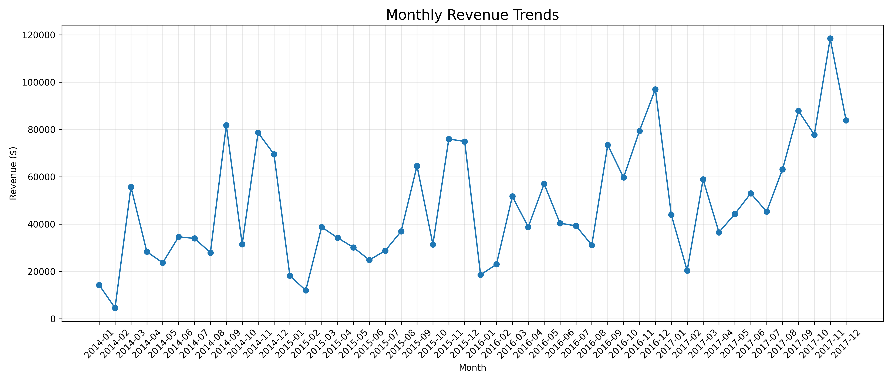
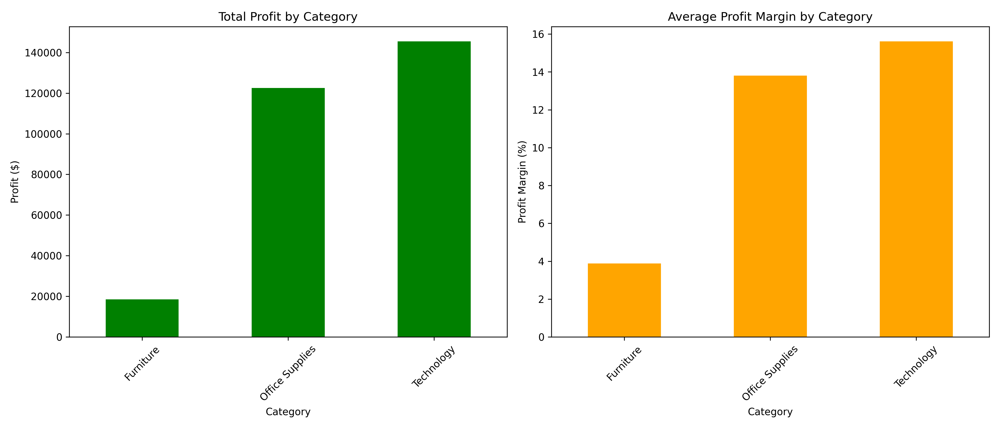
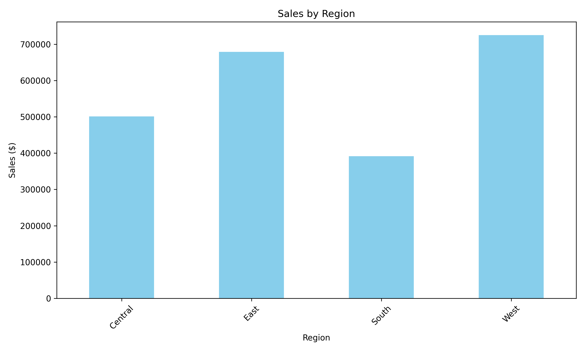
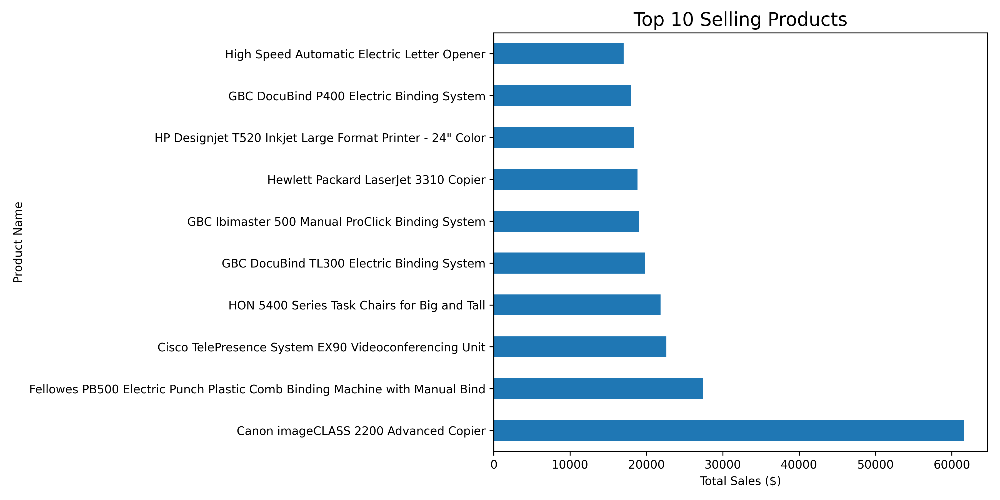

# Task 5: Salse Data Analysis

## Problem Statement
Exploratory Data Analysis (EDA) project on Superstore sales dataset using Python to analyze sales trends, profits, regional performance, and top-selling products through visualizations.

---
## Problem Overview
This project performs **Exploratory Data Analysis (EDA)** on Superstore sales data using Python.  
The analysis focuses on understanding sales trends, revenue growth, profit distribution, regional performance, and top-selling products through visualizations.

## Dataset Details
* **Dataset Name:** SuperStore Sales Dataset
* **Source:** Kaggle
* **Link:** https://www.kaggle.com/datasets/vivek468/superstore-dataset-final?resource=download
# 📂 Dataset Features

The dataset contains sales-related information such as:

| Feature | Description |
|---|---|
| Order Date | Date of purchase |
| Sales | Revenue generated |
| Profit | Profit earned from sales |
| Category | Product category |
| Product Name | Name of the product |
| Region | Sales region |
| Quantity | Number of items sold |
| Discount | Discount applied |
| Profit Margin | Percentage profit earned |

---

# ⚙️ Approach

The following steps were performed during analysis:

## 1. Data Loading
- Imported dataset using Pandas
- Loaded data into DataFrame

## 2. Data Cleaning
- Checked missing values
- Converted date columns into datetime format
- Removed unnecessary columns if required

## 3. Exploratory Data Analysis
Performed analysis using:
- GroupBy operations
- Aggregations
- Sorting and filtering
- Revenue and profit calculations

## 4. Data Visualization
Created multiple charts for better understanding:
- Line charts
- Bar charts
- Horizontal bar charts

---

# 📈 Visualizations

## 1. Monthly Revenue Trends

Shows monthly revenue growth over time.

---

## 2. Profit Analysis by Category

Displays total profit and average profit margin across categories.

---

## 3. Regional Sales Analysis

Compares total sales across different regions.

---

## 4. Top 10 Selling Products

Shows products generating highest sales revenue.

---

# 📊 Results

- Technology category generated the highest profit
- West region achieved maximum sales
- Revenue increased significantly in later months
- Some products contributed major portions of total sales
- Furniture category had comparatively lower profit margins

---

# 💡 Insights

## Business Insights

- Technology products are highly profitable
- Regional sales performance differs significantly
- Seasonal sales trends are visible in revenue charts
- High-value products drive overall revenue growth
- Profit margins can help identify efficient product categories

---
## Deliverables Included
* `Task-05.ipynb` (Jupyter Notebook containing the full EDA code and visualizations)
* Demonstration Video Link: `coming soon...`
